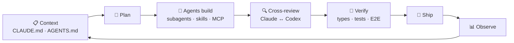

# `> whoami`

<div align="center">

```text
██╗ ██████╗  ██████╗  ██╗      ██╗   ██╗
██║ ██╔══██╗ ██╔══██╗ ██║      ╚██╗ ██╔╝
██║ ██████╔╝ ██████╔╝ ██║       ╚████╔╝
██║ ██╔══██╗ ██╔══██╗ ██║        ╚██╔╝
██║ ██████╔╝ ██║  ██║ ███████╗    ██║
╚═╝ ╚═════╝  ╚═╝  ╚═╝ ╚══════╝    ╚═╝
```

### SENIOR FULL STACK ENGINEER

**Ibrahim Ahmed. I build commerce platforms and ship with AI agents.**

`Headless Commerce` · `Next.js` · `Node.js` · `Agentic Engineering` · `MCP` · `Cloud-Native`

<br>


</div>

---

## `01 // THE ENGINEER`

```ts
const ibrly = {
  name: "Ibrahim Ahmed",
  role: "Senior Full Stack Engineer",
  location: "Cairo, Egypt 🇪🇬",
  site: "https://ibrly.dev",

  shipped: [
    "commercetools — composable commerce platform",
    "Mars — M&M'S (mms.com), frontend tech lead",
    "DEPOT / Gries Deco — headless storefronts",
    "Elevate AB — A/B testing for Shopify",
  ],

  focus: [
    "Headless & Composable Commerce",
    "Frontend Architecture",
    "Multi-tenant SaaS",
    "Agentic Development & MCP",
    "Performance Engineering",
  ],

  philosophy: {
    architecture: "Boundaries first, frameworks second.",
    code: "Types are documentation that compiles.",
    performance: "Lighthouse is a test, not a vanity metric.",
    ai: "Agents write code. Humans own it.",
    shipping: "Verified > fast > clever.",
  },

  status: "BUILDING",
} as const;
```

I work **end-to-end**, from Postgres schemas and event-driven workers to the storefront pixel a shopper taps.

The work I like most mixes **commerce at scale**, **frontend architecture**, and **AI-native engineering**.

---

## `02 // SYSTEM LOADOUT`

<div align="center">

### ⚡ CORE


### ⚙️ BACKEND


### 🛒 COMMERCE


### 🤖 AI / AGENTS


### 🗄️ DATA


### ☁️ INFRASTRUCTURE


### 🧪 QUALITY


</div>

---

## `03 // HOW I SHIP WITH AGENTS`



> **Agents move fast. Guardrails keep that speed from turning into production incidents.**

What that looks like day to day:

* 🧠 **Context engineering**: decision logs and handoff docs that keep agents aligned with the codebase.
* 🛠️ **Custom skills & subagents**: releases, hotfixes, and PR chores reduced to one-line commands.
* 🔌 **MCP servers**: auth, policy-based authorization, risk-tiered tools, and audit logs.
* 🔗 **Wired-in tools**: GitHub, Jira, Azure DevOps, Figma, commercetools, and PostHog available inside the agent loop.
* 🛡️ **Guardrails**: allow/deny rules, permission policies, and secret hygiene.
* ✅ **Verified output**: nothing merges until types, tests, E2E, and review pass.

---

## `04 // CURRENT OPERATING MODE`

```yaml
engineer:
  level: senior

  mode:
    - BUILD
    - VERIFY
    - SHIP
    - REPEAT

  currently_exploring:
    - MCP gateways & agent authorization
    - Multi-agent orchestration
    - Multi-tenant SaaS (Postgres RLS)
    - Event-driven workers
    - Self-hosted, first-party analytics
    - React Server Components at scale

  optimization_target:
    LCP: ↓
    INP: ↓
    CLS: ↓
    bundle_size: ↓
    developer_experience: ↑
    conversion_rate: ↑↑↑
```

---

## `05 // THE STACK IS NOT THE SKILL`

Angular gave way to React. REST gained GraphQL. Hand-written code now has agent-written code alongside it.

The part that stays the same:

```text
┌──────────────────────────────────────────────────────┐
│                                                      │
│   UNDERSTAND → DESIGN → BUILD → VERIFY → OPERATE     │
│                                                      │
│     ...and review every line an agent writes.        │
│                                                      │
└──────────────────────────────────────────────────────┘
```

---

## `06 // ENGINEERING DNA`

```text
╭─────────────────────────────────────────────────────────╮
│                                                         │
│   FRONTEND        ████████████████████   ARCHITECTURE   │
│   COMMERCE        ███████████████████░   HEADLESS       │
│   BACKEND         ██████████████████░░   APIs & WORKERS │
│   AI / AGENTS     ███████████████████░   MCP & SKILLS   │
│   PERFORMANCE     ███████████████████░   CORE VITALS    │
│   DEVOPS          ████████████████░░░░   SHIPPING       │
│                                                         │
╰─────────────────────────────────────────────────────────╯
```

---

## `07 // GITHUB TELEMETRY`

<div align="center">


<br><br>

[](https://git.io/streak-stats)

</div>

---

## `08 // WHEN THE AGENT GOES ROGUE`

```bash
$ claude --dangerously-skip-permissions
[DENIED] policy: ibrly/guardrails.json
```

```bash
$ git log --oneline -3

5ae2204 fix: agent's fix
b266811 fix: fix for agent's fix
96d52c2 revert: all of the above, wrote it by hand ☕
```

---

## `09 // CONNECT`

<div align="center">

### Want to talk commerce, agents, or frontend architecture?

**Happy to trade notes.**

[](https://ibrly.dev)
[](https://github.com/ibrly)
[](https://instagram.com/iibrly)

<br>

```text
while (alive) {
    plan();
    delegate();
    verify();
    ship();
}
```

### `SYSTEM STATUS: ONLINE 🟢`

<sub>Pair-programmed with Claude and fueled by coffee.</sub>

</div>
